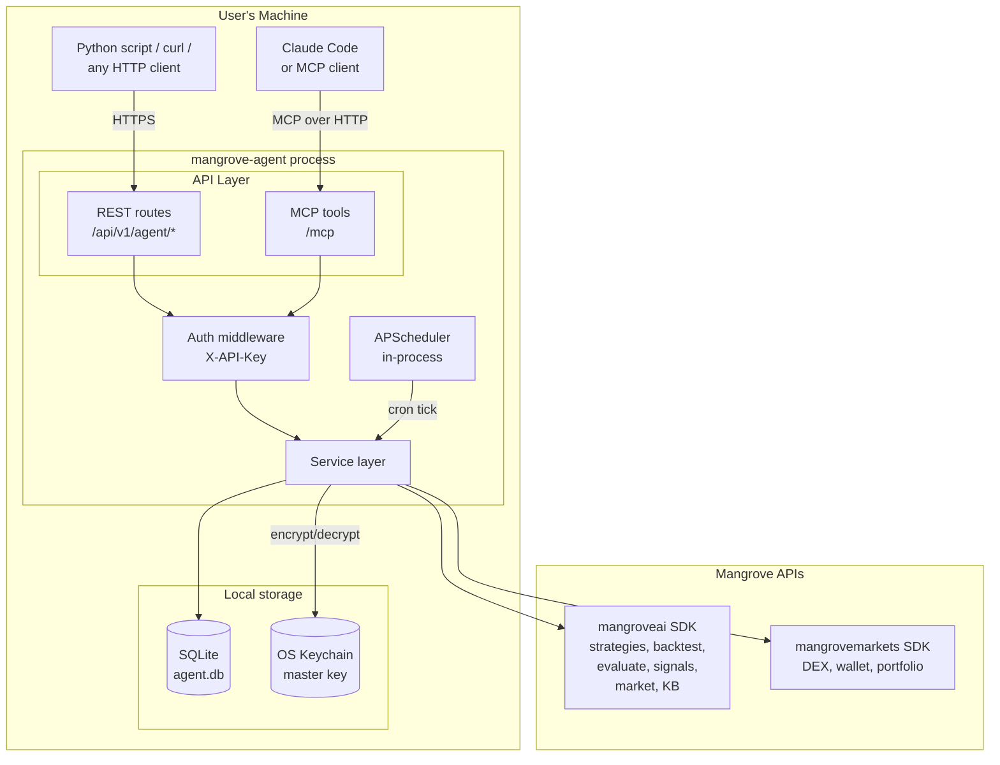
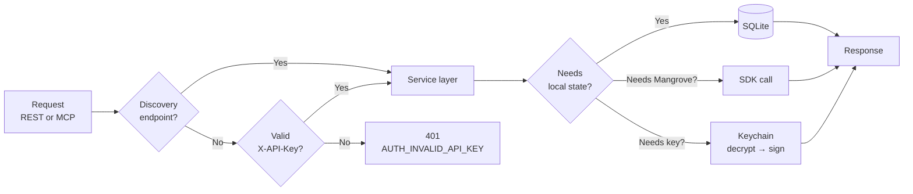
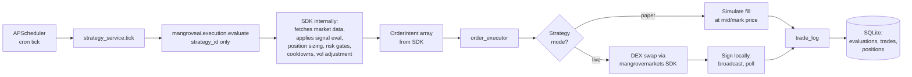
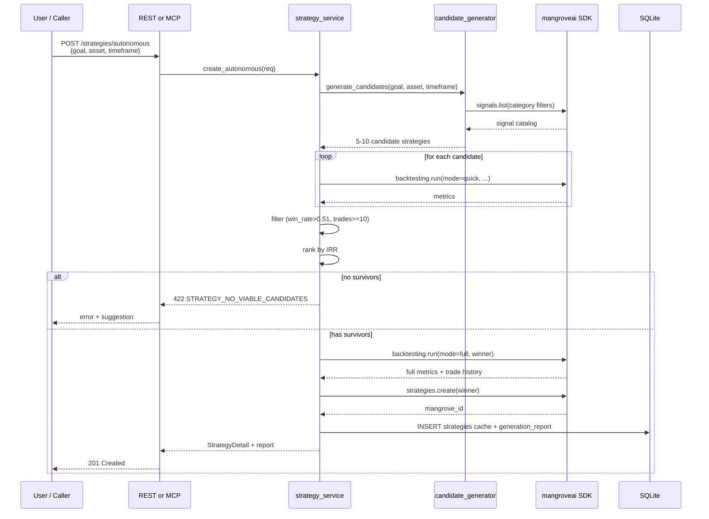
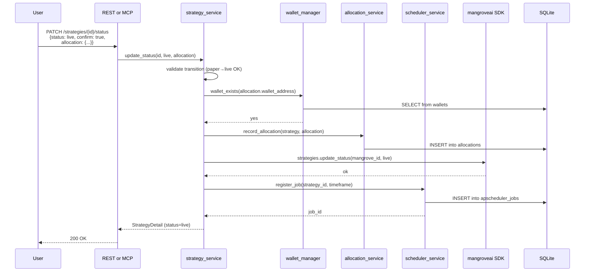
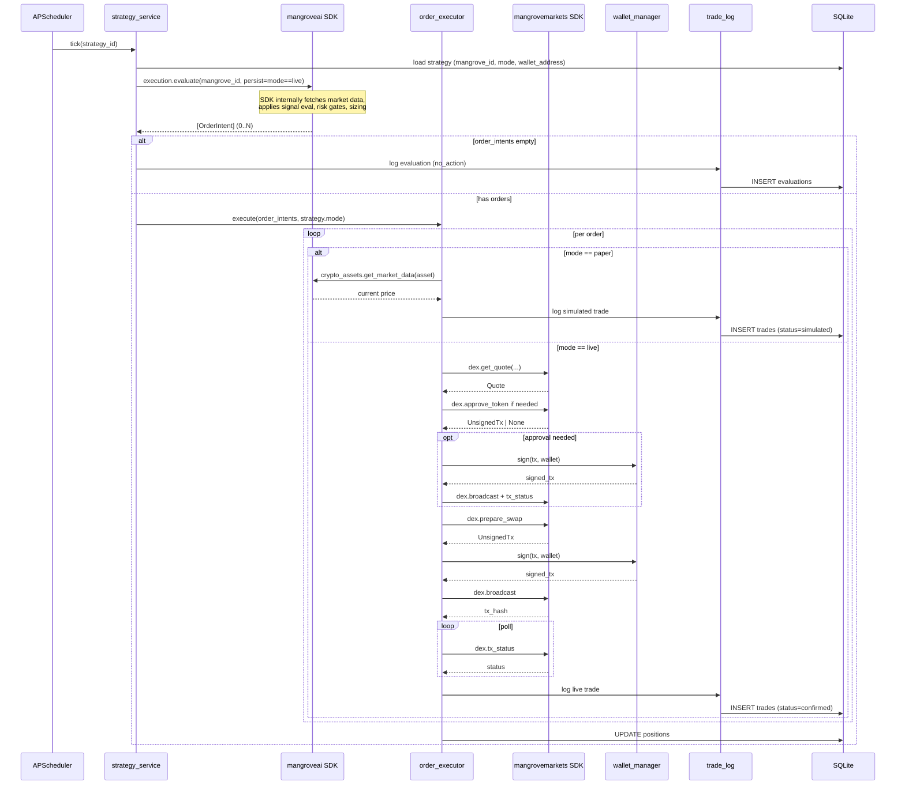
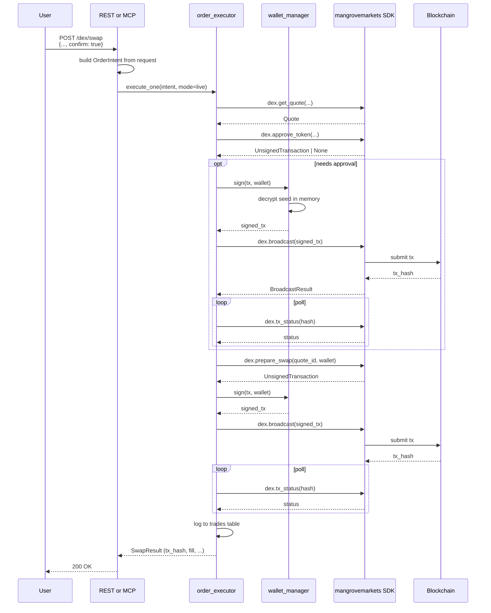
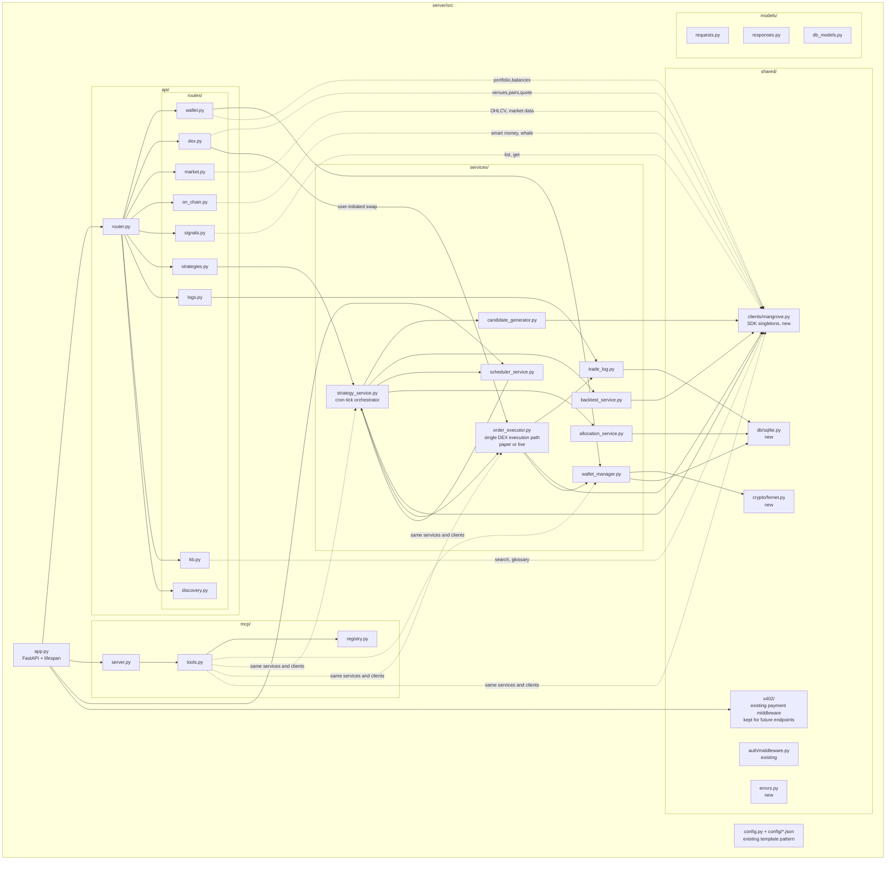
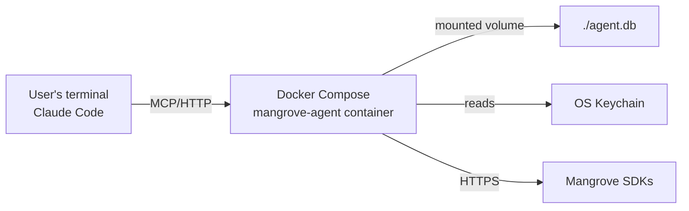

# Architecture: mangrove-agent

**Generated:** 2026-04-17
**Status:** Draft
**Based on:** `docs/specification.md`

## Overview

mangrove-agent is a local FastAPI + MCP service that wraps two Mangrove SDKs and runs strategies on in-process cron jobs. The architecture is deliberately minimal:

- **One process.** FastAPI app serves REST + MCP + runs the scheduler in-process.
- **One datastore.** SQLite for everything — business data and the APScheduler jobstore share a DB file.
- **Two external dependencies.** `mangroveai` and `mangrovemarkets` SDKs. That's it.
- **Zero local logic where the SDK already does the work.** Strategy evaluation, risk gates, position sizing, cooldowns, volatility adjustments — all of that lives in Mangrove's execution engine. The agent calls the SDK and executes the returned orders. It does not reimplement any of that logic.

No Postgres, no Redis, no x402, no message queues, no separate scheduler service.

Cloud deployment is out of scope for v1. See [Roadmap](#roadmap).

---

## System Architecture



### Component responsibilities

| Component | Responsibility |
|-----------|---------------|
| REST routes | HTTP handlers under `/api/v1/agent/*`; delegate to service layer |
| MCP tools | FastMCP tool handlers at `/mcp`; delegate to service layer |
| Auth middleware | Validate `X-API-Key` against configured API key; bypass for discovery |
| Service layer | Orchestration — no strategy/risk logic; that's all in Mangrove |
| Scheduler | APScheduler BackgroundScheduler, SQLite jobstore |
| SQLite | Wallets (encrypted), strategies cache, allocations, evaluations, trades, positions, APScheduler jobs |
| OS Keychain | Stores the Fernet master key; config-resolved secret is the fallback |

---

## Data Flow — Request Path



Auth is enforced once at the boundary. The service layer is protocol-agnostic — it doesn't know or care whether the caller came in via REST or MCP.

---

## Data Flow — Automated Evaluation Loop



**Critical:** the agent does not evaluate strategies locally, and **does not fetch market data for evaluation** — `mangroveai.execution.evaluate(strategy_id)` takes a strategy ID only and handles everything internally: market data fetch, signal evaluation, risk gates (`max_risk_per_trade`, `max_open_positions`, `max_trades_per_day`), position sizing, volatility adjustment, and cooldown enforcement. The agent's job is:
1. Call the SDK evaluate endpoint with just the strategy ID
2. Branch the returned `OrderIntent[]` to paper or live execution
3. Log everything

The agent DOES fetch market data for a separate purpose: getting a mark price to simulate paper-mode fills inside `order_executor`. That's a different code path from evaluation.

---

## Sequence — Autonomous Strategy Creation



Candidate generation uses **deterministic heuristics** — a rules table mapping goal keywords (momentum, mean_reversion, breakout, trend) to signal categories, with random sampling within each category for diversity. No LLM call from the server. Intelligence lives in the mapping + the user's choice of goal language.

---

## Sequence — Strategy Activation (→ live)



From here, the scheduler fires independently on the strategy's timeframe — no user involvement until they deactivate.

---

## Sequence — Cron Tick (strategy evaluation)



The evaluator logic is entirely inside `mangroveai.execution.evaluate()`. The agent's `strategy_service` is a thin orchestrator: fetch data, call SDK, dispatch results to the executor.

---

## Sequence — DEX Swap (user-initiated)

User-initiated swaps and cron-driven swaps share the same execution path: the route handler builds an `OrderIntent` from the request and calls `order_executor.execute_one(intent, mode='live')`. There is no separate `dex_service`.



The full 6-step flow, mediated entirely by the agent. The SDK never touches the private key. The key is decrypted in `wallet_manager.sign()` and zeroed from memory immediately after.

---

## Chain Support — v1

v1 is **EVM-only** for live execution. Specifically, whatever chains the `mangrovemarkets` DEX service supports: Ethereum (1), Base (8453), Arbitrum (42161), Polygon (137), Optimism (10), BNB (56), Avalanche (43114), zkSync (324), Gnosis (100), Linea (59144).

| Chain family | Wallet create | Live DEX swap | Strategy execution |
|--------------|---------------|---------------|---------------------|
| EVM | ✅ | ✅ | ✅ live or paper |
| XRPL | 🟡 Stub ("not yet supported in v1") | ❌ | ❌ |
| Solana | ❌ Skip entirely | ❌ Upstream not supported | ❌ |

Rationale: Mangrove's DEX integration wraps 1inch, which is EVM-only in Mangrove's SDK. Solana requires upstream work in `mangrovemarkets` before the agent can support it. XRPL gets a clean "not supported in v1" stub so the API shape doesn't break when it's added later.

---

## Component Diagram — Server Internals



Key properties:
- **Routes never call SDKs directly.** Always through the service layer.
- **MCP tools and REST routes call the same services.** Logic lives in one place.
- **`strategy_service` is thin.** Loads strategy from local cache, calls `mangroveai.execution.evaluate(strategy_id)`, dispatches returned orders to the executor. Does not fetch market data (SDK handles that), does not evaluate signals, does not size positions, does not enforce risk gates — all of that lives in the SDK.
- **SDK clients are singletons** initialized at startup (`shared/clients/mangrove.py`), shared across services.

---

## Configuration

The agent uses the existing mangrove-agent config pattern — no invented `.env` files, no parallel config layer.

### How the config system works

- `server/src/config/{environment}-config.json` holds all configuration for that env
- `ENVIRONMENT` env var selects which file to load (`local`, `dev`, `test`, `prod`)
- `server/src/config/configuration-keys.json` declares the required keys
- Values can be literal strings/numbers, or `secret:NAME:PROPERTY` references that resolve through GCP Secret Manager (a mechanism that stays in the template but isn't used by local deployments)
- Local dev: put values directly in `local-config.json` (gitignored)

### Configuration keys for mangrove-agent

Replace the template's `configuration-keys.json` with:

```json
{
  "required": [
    "AUTH_ENABLED",
    "API_KEY",
    "MANGROVE_API_KEY",
    "MANGROVEMARKETS_BASE_URL",
    "DB_PATH",
    "KEYRING_SERVICE_NAME",
    "MASTER_KEY_ENV_FALLBACK",
    "BACKTEST_CANDIDATE_COUNT",
    "BACKTEST_MIN_WIN_RATE",
    "BACKTEST_MIN_TRADES",
    "BACKTEST_DEFAULT_LOOKBACK_MONTHS",
    "LOG_RETENTION_DAYS"
  ],
  "full_app_keys": []
}
```

### Example `local-config.json`

```json
{
  "AUTH_ENABLED": true,
  "API_KEY": "local-dev-key",
  "MANGROVE_API_KEY": "dev_...",
  "MANGROVEMARKETS_BASE_URL": "http://localhost:9081",
  "DB_PATH": "./agent.db",
  "KEYRING_SERVICE_NAME": "mangrove-agent",
  "MASTER_KEY_ENV_FALLBACK": "",
  "BACKTEST_CANDIDATE_COUNT": 7,
  "BACKTEST_MIN_WIN_RATE": 0.51,
  "BACKTEST_MIN_TRADES": 10,
  "BACKTEST_DEFAULT_LOOKBACK_MONTHS": 3,
  "LOG_RETENTION_DAYS": 90
}
```

Secrets (API keys, master key fallback) can optionally be referenced as `"secret:mangrove-api-key:value"` when running in an environment that has Secret Manager configured — the local deployment puts literal values in the file.

The Fernet master key itself is **not** in config. It's stored in the OS Keychain under the service name `mangrove-agent`. The `MASTER_KEY_ENV_FALLBACK` config key exists for environments without a keychain — if set (non-empty), the agent uses that value instead of the keychain. Local dev leaves it empty.

### Full app keys (empty for v1)

`full_app_keys` is empty — no Postgres or Redis. If v2 adds them, they go here.

---

## Project Structure

```
mangrove-agent/
├── .claude/                                    # Development framework
│   ├── agents/
│   │   └── product-owner.md                    # Drives build after /plan
│   ├── hooks/
│   │   └── check-onboard.sh
│   ├── rules/
│   │   └── git-workflow.md
│   ├── skills/
│   │   ├── onboard/SKILL.md
│   │   ├── requirements/SKILL.md
│   │   ├── specification/SKILL.md
│   │   ├── architecture/SKILL.md
│   │   ├── plan/SKILL.md
│   │   └── tutorial/SKILL.md                   # Workshop curriculum
│   └── settings.json
├── server/
│   ├── src/
│   │   ├── app.py                              # FastAPI factory, scheduler lifespan
│   │   ├── config.py                           # Existing config loader (unchanged)
│   │   ├── config/
│   │   │   ├── configuration-keys.json         # Updated: agent's required keys
│   │   │   ├── local-config.json               # Local dev values
│   │   │   ├── dev-config.json
│   │   │   ├── test-config.json
│   │   │   └── prod-config.json                # Kept but unused in v1
│   │   ├── api/
│   │   │   ├── router.py                       # Aggregates routes, mounts /api/v1/agent
│   │   │   └── routes/
│   │   │       ├── discovery.py                # health, status, tool catalog
│   │   │       ├── wallet.py                   # create, list, balances, portfolio, history
│   │   │       ├── dex.py                      # venues, pairs, quote, swap
│   │   │       ├── market.py                   # ohlcv, data, trending, global
│   │   │       ├── on_chain.py                 # smart_money, whale, holders
│   │   │       ├── signals.py                  # list, get
│   │   │       ├── strategies.py               # create, list, get, patch status, backtest, evaluate
│   │   │       ├── logs.py                     # evaluations, trades
│   │   │       ├── kb.py                       # search, glossary
│   │   │       └── hello_mangrove.py           # x402 demo route (renamed from template's easter_egg.py)
│   │   ├── mcp/
│   │   │   ├── server.py                       # FastMCP setup
│   │   │   ├── tools.py                        # Tool definitions (mirror REST)
│   │   │   └── registry.py                     # register_tool helper
│   │   ├── services/                           # Only services that ADD orchestration
│   │   │   ├── wallet_manager.py               # Key gen, Fernet encrypt, local signing
│   │   │   ├── strategy_service.py             # Cron orchestrator: data → SDK evaluate → executor
│   │   │   ├── candidate_generator.py          # Goal → 5-10 signal combos
│   │   │   ├── backtest_service.py             # Quick + full, filter + IRR rank
│   │   │   ├── order_executor.py               # SINGLE swap path: cron-driven OR user-initiated
│   │   │   ├── scheduler_service.py            # APScheduler wrapper
│   │   │   ├── trade_log.py                    # SQLite writes
│   │   │   └── allocation_service.py           # Per-strategy fund accounting
│   │   ├── shared/
│   │   │   ├── auth/middleware.py              # X-API-Key validation (existing)
│   │   │   ├── x402/                           # Existing payment middleware (kept; no v1 endpoints use it yet)
│   │   │   ├── db/
│   │   │   │   ├── sqlite.py                   # Connection helper, migrations
│   │   │   │   └── migrations/                 # SQL schema files
│   │   │   ├── crypto/
│   │   │   │   └── fernet.py                   # Master key mgmt + Fernet wrapper
│   │   │   ├── clients/
│   │   │   │   └── mangrove.py                 # SDK singletons (called directly by routes)
│   │   │   └── errors.py                       # Error codes, exception → HTTP mapping
│   │   ├── models/
│   │   │   ├── requests.py                     # Pydantic request models
│   │   │   ├── responses.py                    # Pydantic response models
│   │   │   └── db_models.py                    # Row adapters
│   │   └── health.py                           # Health probe payload
│   ├── tests/
│   │   ├── conftest.py
│   │   ├── unit/
│   │   ├── integration/
│   │   └── e2e/
│   ├── Dockerfile
│   └── requirements.txt
├── tutorials/                                  # Workshop curriculum (separate deliverable)
│   └── bots-and-bytes/
├── docs/
│   ├── api-reference.md
│   ├── user-stories.md
│   ├── specification.md
│   ├── architecture.md                         # This document
│   ├── implementation-plan.md
│   └── configuration.md
├── assets/
├── docker-compose.yml                          # Local dev stack (app only)
├── CLAUDE.md
├── README.md
└── LICENSE
```

---

## Module Decisions

| Module | Status | Reason |
|--------|--------|--------|
| **FastAPI app factory** | ✅ Keep | Core of the dual-protocol service pattern |
| **MCP server (FastMCP)** | ✅ Keep | Core — AI agents prefer MCP |
| **REST routes** | ✅ Keep | Core — universal HTTP access |
| **API key auth middleware** | ✅ Keep | Single-user auth model |
| **Service layer pattern** | ✅ Keep | Shared business logic between REST + MCP |
| **Per-environment JSON config** | ✅ Keep | Existing pattern; no `.env` files or parallel systems |
| **configuration-keys.json** | ✅ Keep, update contents | Replace x402 keys with agent keys |
| **SQLite (built-in)** | ✅ Keep | Single datastore for all state |
| **APScheduler** | ✅ Add (new) | In-process cron; not in template |
| **Fernet encryption + OS keychain** | ✅ Add (new) | Wallet key protection |
| **PostgreSQL** | ❌ Remove | SQLite suffices. Remove `--profile full`, `db/init.sql` postgres schema, `notes.py` route. |
| **Redis** | ❌ Remove | No caching; APScheduler jobstore goes in SQLite. |
| **x402 payment middleware** | ✅ Keep | Will be enabled later. Stays wired up so future endpoints can move to the payment tier without scaffolding work. |
| **`shared/x402/` config + server** | ✅ Keep | Same reason. |
| **`routes/hello_mangrove.py` (x402 demo, renamed from `easter_egg.py`)** | ✅ Keep | Smoke test for the payment path; harmless to ship. |
| **x402 config keys in `configuration-keys.json`** | ✅ Keep | Required at startup by the payment middleware. |
| **Items demo route** | ❌ Remove | Template scaffolding. |
| **Notes demo route** | ❌ Remove | Template scaffolding (Postgres-backed). |
| **Echo route** | ❌ Remove | Template scaffolding. |
| **Terraform (GCP)** | ❌ Remove | Cloud is out of scope for v1. Delete `infra/terraform/`. |
| **GitHub Actions: `deploy-cloudrun.yaml`** | ❌ Remove | Cloud is out of scope for v1. |
| **GitHub Actions: `ci.yml`** | ✅ Keep | Lint + test on push/PR. |
| **Docker Compose (app-only)** | ✅ Keep | Primary local dev entry point. |
| **Docker Compose (full profile)** | ❌ Remove | Postgres + Redis not needed. |
| **Pass-through service modules** (`signal_service`, `market_data`, `on_chain`, `kb_service`, `dex_service`, `portfolio_service`) | ❌ Don't create | Routes call SDK clients directly; wrapping the SDK adds nothing. |

---

## Technology Choices

| Layer | Choice | Rationale |
|-------|--------|-----------|
| Web framework | FastAPI | Template default; great OpenAPI; async-native; plays well with FastMCP |
| MCP library | FastMCP | Template default; FastAPI-integrated; tool registration is a one-liner |
| Storage | SQLite | Local-first means no external DB. Full ACID, WAL mode for concurrency, built into Python. |
| Scheduler | APScheduler (BackgroundScheduler, SQLAlchemy jobstore) | In-process, no broker required, persistent jobstore, Python-native |
| Key encryption | Fernet (from `cryptography`) | Battle-tested, standard-compliant, simple API |
| Master key storage | OS Keychain via `keyring`, config-referenced fallback | Zero-config for local users |
| Config | Existing template pattern (`config/*.json` + `configuration-keys.json`) | No parallel system; consistent with rest of template |
| HTTP client | `httpx` via SDKs | Built into upstream SDKs |
| Test framework | pytest | Template default |

---

## Deployment

### Local (the only supported mode for v1)



One `docker compose up` command. No cloud account required. State persists across restarts via bind-mounted volume.

For users without Docker, running directly against Python 3.11+ is also supported: `uvicorn src.app:app --reload`.

### Roadmap

Future deployment modes (Cloud Run with persistent storage, Cloud SQL backing, multi-region) are **out of scope for v1**. They will be addressed in a subsequent release once the local pattern is stable and the workshop curriculum is shipped.
