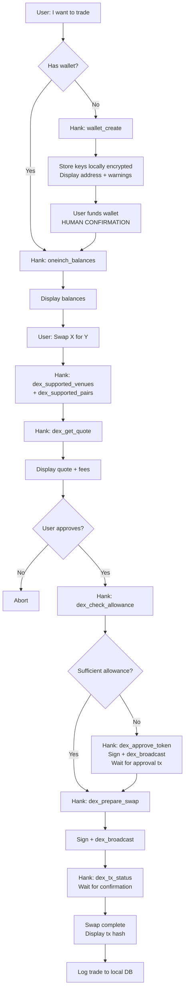
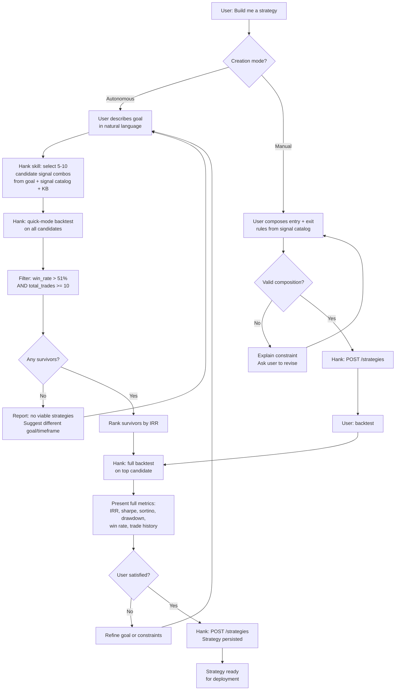
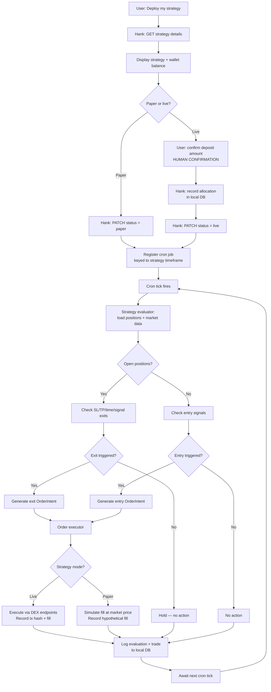
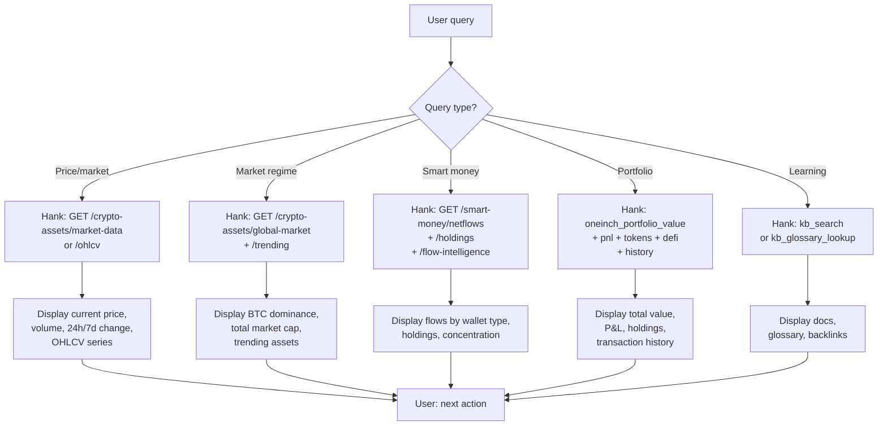

# Hank — User Stories & Flows

Scope for the AI trading bot ("Hank", project code: `mangrove-agent`). These stories and flows define the surface area the Mangrove SDK + MCP server must expose. Endpoint-level detail is in [`api-reference.md`](./api-reference.md).

**Users:** both humans and agents, via chat interface (no UI).
**Funds:** real funds.
**Risk management:** fully delegated to the Mangrove API (`execution_config`). The only human-confirmed financial actions are **deposits to a strategy** and **withdrawals from a strategy**.

---

## Architecture Decisions

These decisions shape the stories and flows below.

### Wallet & Key Management
- **Hank holds wallet keys directly.** No smart contract, no escrow, no platform-backend dependency.
- Keys stored locally (encrypted). User's wallet IS the strategy wallet.
- Multiple strategies on one wallet → Hank tracks allocations in local DB.
- No KMS, no admin signer. Hank runs locally under user control.

### Strategy Generation
- **Hank autonomously generates candidates** from a user's natural-language goal via a dedicated skill.
- The skill uses signal metadata + KB knowledge to intelligently pick 5–10 viable candidates.
- Manual strategy composition remains available as a power-user path.

### Three-Stage Backtest Flow
1. **Skill** picks 5–10 viable candidates from goal
2. **Quick-mode backtest** on all candidates (lightweight, fast ranking)
3. **Filter:** `win_rate > 51%`, `total_trades >= 10`
4. **Rank** by IRR (annualized)
5. **Full backtest** on top-1 for deep analysis
6. Present to user for deploy decision

### Execution Model
- **Cron-based.** When a strategy goes `paper` or `live`, Hank registers a cron job keyed to the strategy's timeframe.
- **Same path for paper and live.** Evaluator returns `OrderIntent[]`; executor branches:
  - `live` → calls DEX endpoints, records tx hash + fill details
  - `paper` → simulates fill at market price, records hypothetical fill
- **Decoupled.** Strategy evaluation is a pure function (market data + positions → order intents). Order execution is a separate module.
- **Live execution:** anything 1inch supports. No artificial chain gating.

### Logging & Audit Trail
- **Every strategy evaluation** is logged (timestamp, strategy_id, market state, signals fired, order intents generated).
- **Every trade** is logged (order intent, execution mode, tx hash (live) or simulated fill (paper), amounts, prices, fees, P&L).
- Local SQLite storage. Full audit trail for every cron tick.

---

## User Stories

18 stories across 4 categories.

### 1. Wallet & DEX Trading

**US-1:** As a user, I want to create a wallet so that I can hold and trade crypto assets.
- [ ] Supports XRPL and EVM chains
- [ ] Returns address and keys (stored locally, encrypted, never sent back)
- [ ] Displays funded status

**US-2:** As a user, I want to check my wallet balances so that I know what assets I hold.
- [ ] Shows all token balances for a given wallet/chain
- [ ] Displays in human-readable format with USD values when available

**US-3:** As a user, I want to see available DEX venues and trading pairs so that I know what I can trade.
- [ ] Lists venues with status and fee info
- [ ] Lists pairs per venue with active status

**US-4:** As a user, I want to get a swap quote so that I can evaluate a trade before committing.
- [ ] Returns best quote across venues or from a specific venue
- [ ] Shows input/output amounts, exchange rate, and fees

**US-5:** As a user, I want to execute a token swap so that I can trade one asset for another.
- [ ] Full flow: quote → check allowance → approve (if needed) → prepare → sign → broadcast → confirm
- [ ] Agent handles signing locally
- [ ] Transaction status tracked to confirmation

### 2. Market Data & Analytics

**US-6:** As a user, I want to get OHLCV data for an asset so that I can analyze price history.
- [ ] Supports configurable time range (days)
- [ ] Returns timestamp, open, high, low, close, volume

**US-7:** As a user, I want to get real-time market data so that I know current prices and trends.
- [ ] Current price, market cap, volume, 24h/7d change, ATH

**US-8:** As a user, I want to see trending assets and global market data so that I can detect market regime shifts.
- [ ] Trending assets with search volume
- [ ] Total market cap, BTC dominance, 24h change

**US-9:** As a user, I want to view on-chain analytics so that I can follow smart money activity.
- [ ] Smart money flows and holdings
- [ ] Token holder distribution and concentration

**US-10:** As a user, I want to view my portfolio value, P&L, holdings, and transaction history so that I can track performance.
- [ ] Portfolio value across chains
- [ ] P&L metrics
- [ ] Token/DeFi holdings breakdown
- [ ] Transaction history

### 3. Strategy & Execution

**US-11:** As a user, I want to browse and search available signals so that I can build informed strategies.
- [ ] List by category (momentum, trend, volume, volatility)
- [ ] Search by name, params, or keywords
- [ ] View parameter specs (type, min, max, defaults)

**US-12:** As a user, I want to create a trading strategy so that I can automate my trading logic.
- [ ] **Autonomous mode (default):** describe a goal in natural language → Hank generates candidates, backtests, and presents the best
- [ ] **Manual mode (power user):** compose entry rules (1 TRIGGER + 0+ FILTERs) and exit rules (0–1 TRIGGER + 0+ FILTERs) directly
- [ ] Configure execution parameters or use defaults
- [ ] Strategy persisted to database

**US-13:** As a user, I want to list and view my strategies so that I can manage my trading portfolio.
- [ ] List with summary view
- [ ] Get full details including rules, config, state

**US-14:** As a user, I want to update my strategy status so that I can move it through its lifecycle.
- [ ] Status transitions: draft → inactive → paper → live → archived

**US-15:** As a user, I want to backtest a strategy against historical data so that I can evaluate its performance.
- [ ] Quick mode: fast ranking across multiple candidates (lightweight, no exec param sweep)
- [ ] Full mode: deep analysis with sharpe, sortino, calmar, max drawdown, win rate, IRR, full trade history
- [ ] Candidate filtering: `win_rate > 51%`, `total_trades >= 10`
- [ ] Candidate ranking: IRR (annualized)

**US-16:** As a user, I want my strategy to automatically evaluate and trade on a schedule so that I don't have to manually trigger execution.
- [ ] Cron job registered at strategy activation, keyed to strategy timeframe
- [ ] Evaluator returns `OrderIntent[]` (pure function, no side effects)
- [ ] Executor places orders: live (DEX) or paper (simulated fill)
- [ ] Same evaluation path for paper and live — only order placement differs
- [ ] All evaluations and trades logged to local DB

**US-17:** As a user, I want to deposit funds to a strategy and withdraw from it so that I can fund and manage my trading.
- [ ] Requires explicit human confirmation
- [ ] Only user-confirmed financial action
- [ ] Funds stay in user's wallet; Hank tracks per-strategy allocations locally

### 4. Knowledge Base

**US-18:** As a user, I want to search trading docs, glossary, and educational content so that I can learn while I trade.
- [ ] Full-text search across trading documentation
- [ ] Glossary term lookup
- [ ] Browse by tag or category

---

## User Flow Diagrams

Four flows cover all 18 stories.

### Flow 1: Wallet Setup & DEX Swap

**Covers:** US-1, US-2, US-3, US-4, US-5

---

### Flow 2: Strategy Creation & Backtesting

**Covers:** US-11, US-12, US-13, US-15

Composition constraint: entry = 1 TRIGGER + 0+ FILTERs, exit = 0–1 TRIGGER + 0+ FILTERs.

---

### Flow 3: Strategy Deployment & Execution

**Covers:** US-14, US-16, US-17

To stop: user requests withdrawal (HUMAN CONFIRMATION) → Hank cancels cron job → PATCH status = inactive → release allocation.

---

### Flow 4: Research & Learning

**Covers:** US-6, US-7, US-8, US-9, US-10, US-18
